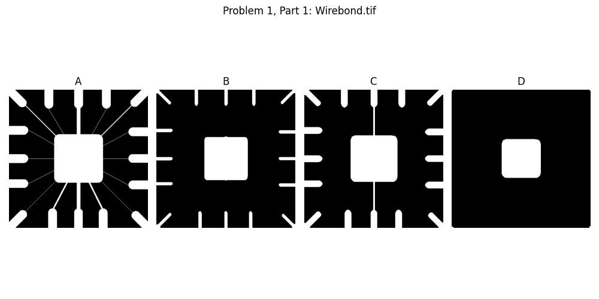
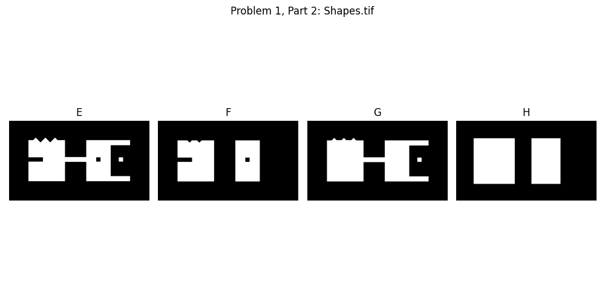
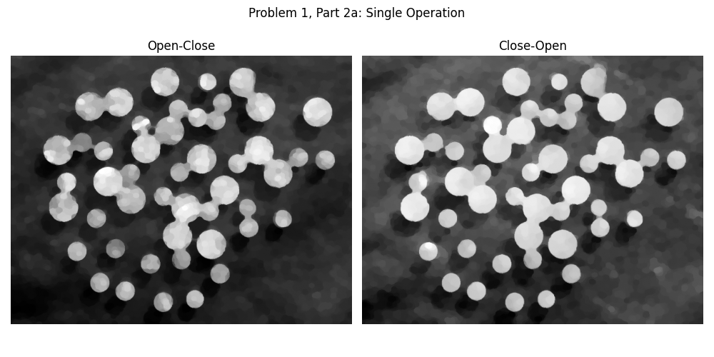
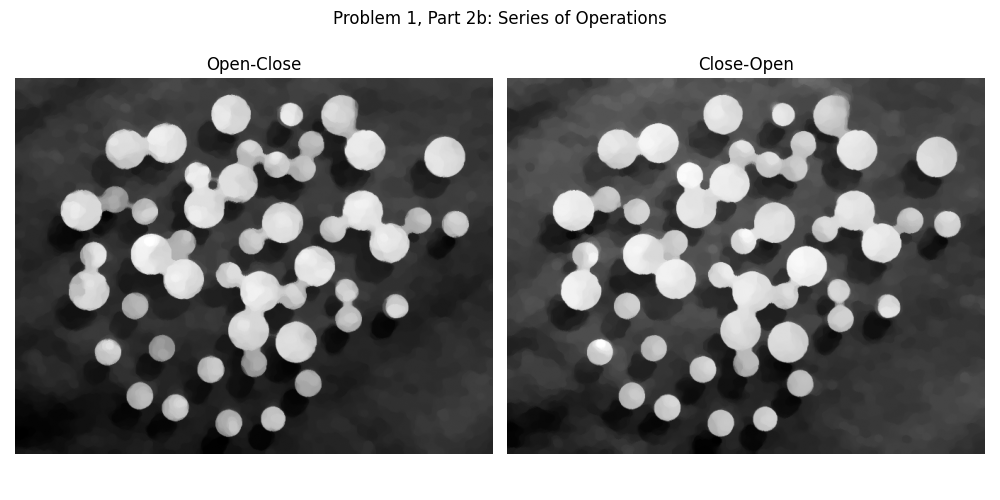
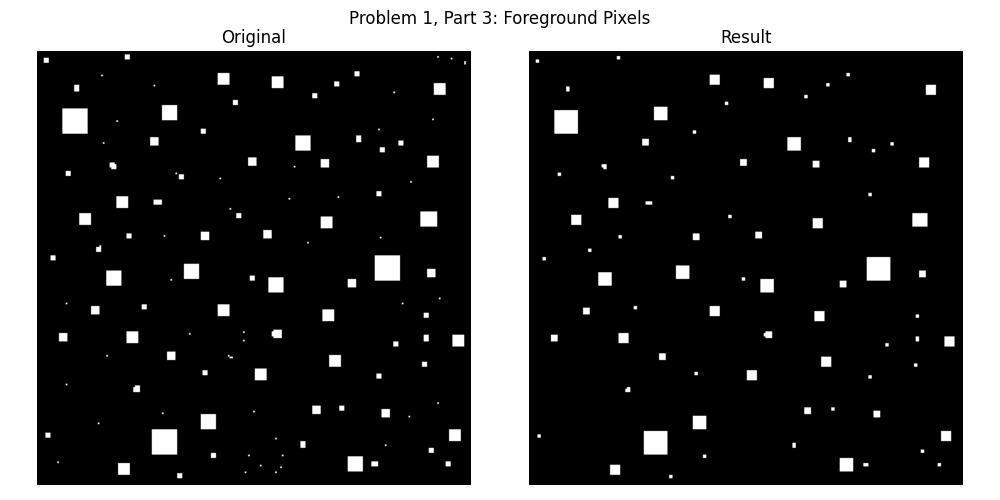
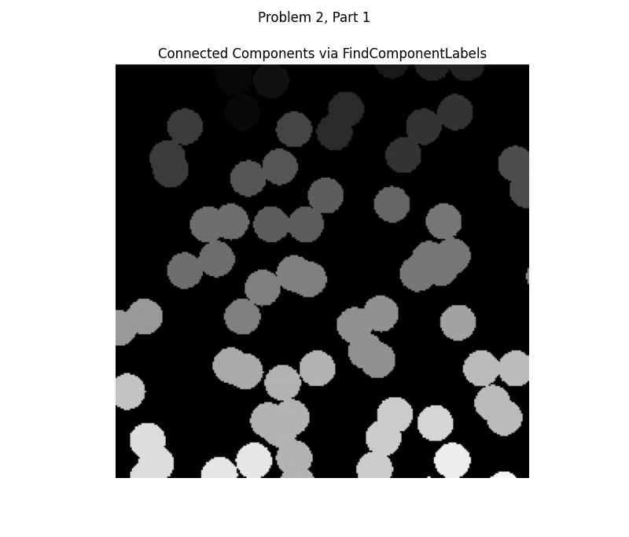
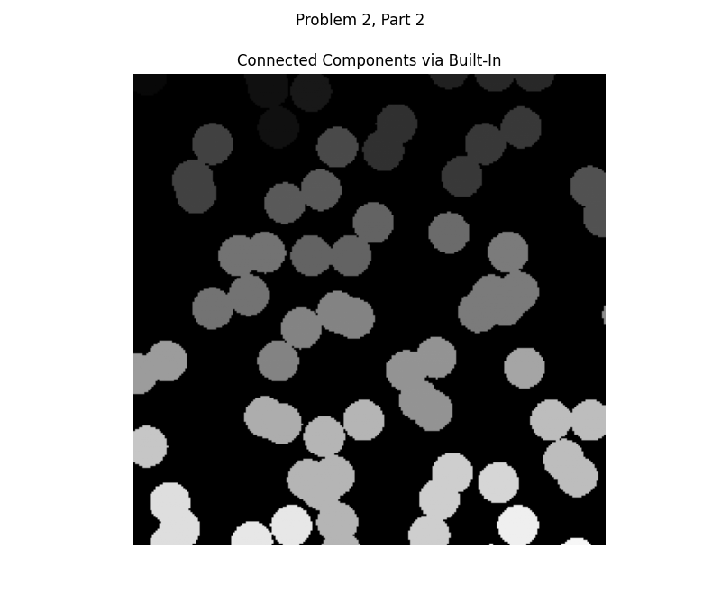
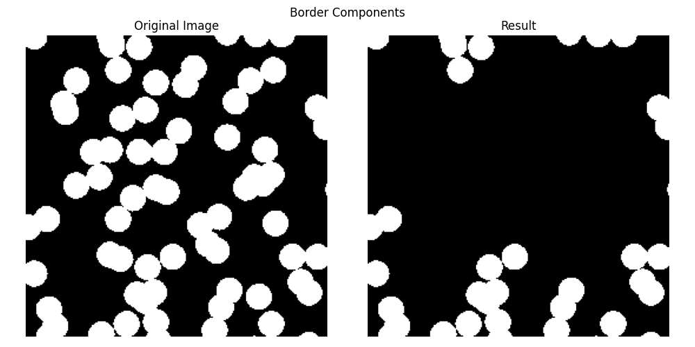
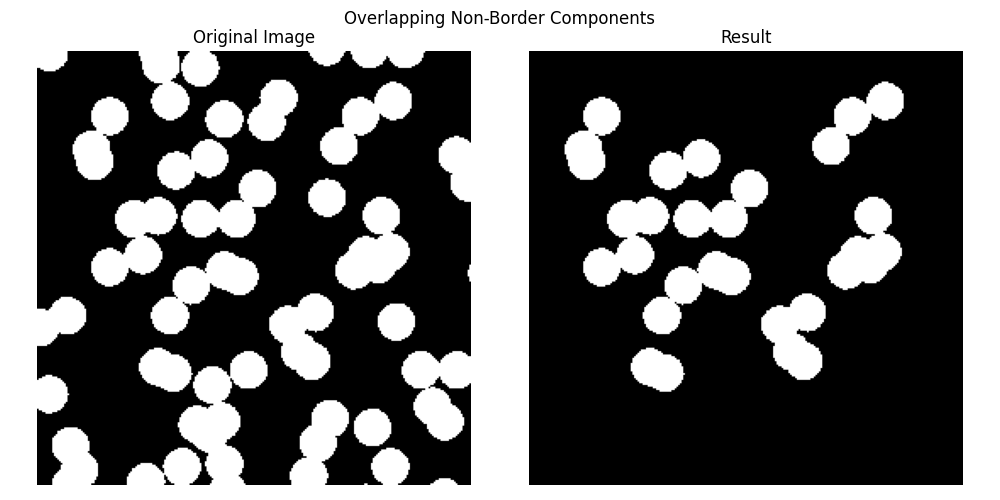

# Morphological Operations - Assignment 5

## Overview
This project demonstrates the application of morphological operations in image processing. Completed as part of CS5680 - Fall Semester 2023, the assignment required solving complex image analysis tasks using morphological operations. It showcases the use of these operations in both problem-solving and real-world applications.

## Accomplishments

### Problem I: Problem Solving Using Morphological Operations
1. **Wirebond.tif**:
   - Applied morphological operations to generate three desired output images.
   

2. **Shapes.tif**:
   - Processed the original image to create three distinct output images using morphological techniques.
   

3. **Dowels.tif**:
   - Performed open-close and close-open operations with a disk structuring element of radius 5.
   - Implemented iterative open-close and close-open operations using structuring elements of increasing size (radius 2 to 5).
     
   

4. **SmallSquares.tif**:
   - Isolated foreground pixels meeting specified neighborhood criteria.
   - Obtained number of foreground pixels:  2808
   

### Problem II: Applications of Morphological Operations
1. **FindComponentLabels Function**:
   - Implemented a custom function (called FindComponentLabels) to label connected components in a binary image.
    - Obtained this number of labels:  31
   

2. **Built-in Labeling**:
   - Used a built-in function to achieve the same functionality as `FindComponentLabels`.
   - Obtained this number of labels via built-in function:  31
   

3. **Border-Connected Particles**:
   - Isolated and displayed particles residing on the image borders.
   - Obtained this number of border components:  17
   

4. **Overlapping Particles**:
   - Produced an image highlighting overlapping particles that do not reside on the borders.
   - Implemented a strategy to estimate particle sizes dynamically, avoiding hard-coded values.
   - Obtained this number of non-border overlapping components:  9
   